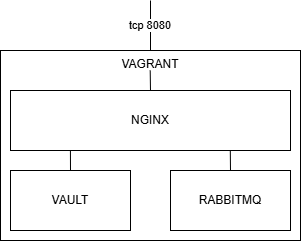

# candidate-interview

## Getting Started

### Sample environment

A Dev environment has created within Vagrant, that consists of NGINX, Vault and RabbitMQ docker containers.
NGINX is used as a reverse proxy.  




### Prerequisites

Vagrant is required, please use the following guide as a reference [Vagrant](https://developer.hashicorp.com/vagrant)

### :computer: Installation

- Complete the prerequisites
- Clone this repo into the Vagrant environment.
- Open a terminal and execute the following within the cloned directory ```vagrant up```
- If successful, the Vagrant VM will be running, and you should see a successful completion.  
  :hourglass: *Should take no longer than 10 minutes*

```
Bringing machine 'default' up with 'virtualbox' provider...
==> default: Checking if box 'ubuntu/jammy64' version '20241002.0.0' is up to date...
==> default: Clearing any previously set forwarded ports...
==> default: Clearing any previously set network interfaces...
==> default: Preparing network interfaces based on configuration...
    default: Adapter 1: nat
==> default: Forwarding ports...
    default: 8080 (guest) => 8080 (host) (adapter 1)
    default: 8081 (guest) => 8081 (host) (adapter 1)
    default: 8082 (guest) => 8082 (host) (adapter 1)
    default: 22 (guest) => 2222 (host) (adapter 1)
==> default: Running 'pre-boot' VM customizations...
==> default: Booting VM...
==> default: Waiting for machine to boot. This may take a few minutes...
    default: SSH address: 127.0.0.1:2222
    default: SSH username: vagrant
    default: SSH auth method: private key
==> default: Machine booted and ready!
.............................................................................................
.............................................................................................
    default: vault_generic_secret.vault: Creating...
    default: vault_generic_secret.vault: Creation complete after 0s [id=secret/rabbitmq]
    default: docker_container.nginx: Creating...
    default: docker_container.rabbitmq: Creating...
    default: docker_container.rabbitmq: Creation complete after 1s [id=5853c64d2a073bdda7da8f3bbd9d2e1c499a77d2f5b27589d6f6aca966ae8e53]
    default: docker_container.nginx: Creation complete after 2s [id=e290c056afea9c1aeb253b6cd131941fc7bf2f549666e2c67d696b361e431e2d]
    default:
    default: Apply complete! Resources: 3 added, 0 changed, 0 destroyed.
    default: ~
```

- Open a Vagrant terminal ```vagrant ssh```
- Confirm the following docker containers are running ```docker ps```
```
CONTAINER ID   IMAGE           COMMAND                  CREATED         STATUS         PORTS                                                                  NAMES
5853c64d2a07   6a77282b9ac7    "docker-entrypoint.s…"   4 minutes ago   Up 4 minutes   4369/tcp, 5671-5672/tcp, 15671-15672/tcp, 15691-15692/tcp, 25672/tcp   rabbitmq
e290c056afea   6784fb0834aa    "/docker-entrypoint.…"   4 minutes ago   Up 4 minutes   0.0.0.0:8080->80/tcp                                                   nginx
486bec12211c   vault:1.11.11   "docker-entrypoint.s…"   8 minutes ago   Up 4 minutes   0.0.0.0:8200->8200/tcp, [::]:8200->8200/tcp                            vault
```

If successful, you can now test the environment before proceeding
``` 
http://{vagrant ip address}:8080
http://{vagrant ip address}:8080/vault/
http://{vagrant ip address}:8080/rabbitmq/
```

### :clipboard: Tasks

This is the time for you to shine :sun_with_face:
We would like you to complete the following tasks:

- [ ] Keep the current Dev environment.
- [ ] Add a Test environment.
   - [ ] Access to http://{vagrant ip address}:8081
   - [ ] Access to http://{vagrant ip address}:8081/vault/
   - [ ] Access to http://{vagrant ip address}:8081/rabbitmq/    
- [ ] Add a QA environment.
   - [ ] Access to http://{vagrant ip address}:8082
   - [ ] Access to http://{vagrant ip address}:8082/vault/
   - [ ] Access to http://{vagrant ip address}:8082/rabbitmq/ 
- [ ] Improve the code.
   - [ ] Terraform plan / apply should be available to run within the Vagrant environment without issues.
- [ ] Add a README detailing your design decissions.

:warning: We are reviewing your code and decisions, not external tools.

### :100: Candidate Instructions

- [ ] Create a private repository.
- [ ] Complete the above tasks.
- [ ] Share your private repository.
- [ ] Email us that the task has been completed.